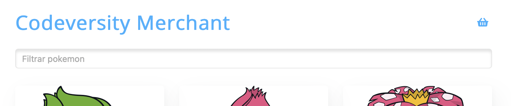

# 02.  Input recomendador React

El objetivo de la aplicación es poder adquirir Pokémons desde la PokeStore. En un principio se le mostrarán todos los pokémon disponibles, sin ninguna opción de filtrado. Como te imaginarás, esto no es realmente deseado, ya que será muy difícil poder encontrar los Pokémon que deseas adquirir.

En sí, este ejercicio consiste en desarrollar un input que entregue sugerencias de búsqueda dentro de una aplicación de compra de Pokémons.

Te entregaremos un market de Pokémon, desarrollado en React al que tendrás que integrarle el nuevo buscador.

# El objetivo

Ver cómo analizas un diseño y qué cosas tienes en cuenta para plantear una solución.

Hay muchísimas formas de llegar a la solución. En este ejercicio no penalizaremos ninguna de las alternativas que elijas para desarrollar.

---

# Lo que necesitas antes de empezar

- [ ]  Compu con internet.
- [ ]  Cuenta en [github](https://github.com/) con acceso a la organización Codeversity.
- [ ]  Entorno local preparado para correr aplicaciones React (revisar)

---

# Lo que hay que hacer

## Preparación

1. En tu compu, descarga el [repositorio](https://github.com/codeversity-tech/Exercises) (empleando el comando `git clone`).
2. Accede a tu rama correspondiente (emplear el comando `git checkout -nombre_rama-`). El nombre de la rama se te informará al momento de la prueba.
3. En el directorio, ejecuta `npm install` y una vez se hayan instalado las bibliotecas ejecuta `npm start`.
4. Escribe comentarios de cosas que creas conveniente discutir frente a la solución que propones, por ejemplo: ¿Tuviste que tomar una decisión de diseño adicional? Va al documento. ¿Tuviste que usar una biblioteca distinta porque la que querías no estaba incluida? Va al documento.

En la carpeta `components/AutocompleteInput` encontrarás la estructura básica de un componente que deberás usar como base para implementar el input que mostrará recomendaciones. La implementación del mismo se hará por etapas, atendiendo a la complejidad de resolución que representa cada etapa.

---

## Entregables

- [ ]  Código de tu rama actualizado con tu solución.
- [ ]  Un documento con comentarios sobre lo que desarrollaste. Si había comentarios, claro.

---

## 1️⃣ Etapa 1

En esta etapa queremos que al escribir sobre el input que está arriba del listado de Pokemons, nos muestre sugerencias dependiendo de lo que estemos escribiendo. Luego de mostrar las sugerencias, al seleccionar alguna debería agregar el elemento seleccionado al carrito.

Input para filtrar.

### 🤔 Ten en cuenta

- No nos importan mucho los estilos del listado de opciones que se desplegarán al escribir una búsqueda, nos importa más la funcionalidad.
- Encontrarás el listado de Pokemon en `lib/initialState`.
- El componente `AutoCompleteInput` acepta la prop `onSelectedItem`, que deberá invocarse al seleccionar un item del listado de sugerencias.

### ✅ ¿Cómo doy por finalizada esta etapa?

Habrás finalizado esta etapa si los siguientes puntos están completos:

- [ ]  Se puede escribir sobre el input
- [ ]  Al escribir en el input se ve un listado de opciones que filtran los resultados por lo que se haya escrito. Por ejemplo: Si se escribe "char" debería mostrar un listado con las opciones: "Charmander", "Charmeleon" y "Charizard".
- [ ]  Al seleccionar algunas de las opciones del listado esta se agrega al carrito.

### 💡Hints

- Principalmente te moverás entre el componente `Products` y el componente `AutoCompleteInput`ya que necesitarás conectar el estado y las props entre sí.

---

## 2️⃣ Etapa 2

En esta etapa no usaremos los datos que vienen directamente del archivo `lib/initialState` si no que usaremos redux y el hook de `useSelector` para traer los datos y pintarlos. Esto es para asegurarnos que la data que se maneja en la aplicación venga del mismo lugar y evitar pintar información incorrecta.

Se debería mostrar un mensaje de "Cargando" al escribir para asegurarnos de que si se tarda en encontrar un resultado quien navega por el sitio entienda que algo se está procesando. Una vez se encuentren las coincidencias, el mensaje desaparecería mostrando los resultados.

### 🤔 Ten en cuenta

- Los pokémons formarán parte del estado general de la aplicación. Deberás usar un selector para usar la información en cada componente.
- Prefiere el uso de los métodos disponibles para seleccionar la data desde el estado central. No uses los métodos funcionales disponibles para los arrays (para conservar la integridad de los datos).
- Se empleará una variable de estado `isLoading`, un booleano que te dice si está cargando la información o no.

### ✅ ¿Cómo doy por finalizada esta etapa?

Habrás finalizado esta etapa si los siguientes puntos están completos:

- [ ]  El comportamiento de la búsqueda sigue siendo el mismo que en la Etapa 1.
- [ ]  La información que pinta el componente `AutoCompleteInput` viene de redux y no se importa directamente en el componente.

### 💡 Hints

- Revisa la documentación sobre el uso del `useSelector` para que entiendas un poco lo que hace.
- Es probable que tengas que cambiar algunos nombres de algunas variables para que funcione el selector. Te recomendamos ver cómo trae la data el componente `Products` para que veas un ejemplo de su funcionamiento.

---

## 3️⃣ Etapa 3

En esta etapa queremos tomar lo que se escribe en el input y utilizar el ciclo de redux para realizar una petición GET a la ruta de pokemon [https://pokeapi.co/api/v2/pokemon?limit=890](https://pokeapi.co/api/v2/pokemon?limit=890). A su vez, con ella actualizar el estado `state.pokemons`.

Te recomendamos usar de referencia el estado UI ya implementado.

### 🤔 Ten en cuenta

- Al momento de realizar la petición, es preciso que se invoque el método del model UI `setLoading` al momento de iniciar y finalizar la petición HTTP, ya que de ese modo se actualizará el estado, siendo visible este cambio para el usuario.
- Usa la biblioteca axios para realizar las peticiones a la API.
- Si la respuesta es fallida, se actualizarán los pokemons con un array vacío.

### ✅ ¿Cómo doy por finalizada esta etapa?

Habrás finalizado esta etapa si los siguientes puntos están completos:

- [ ]  La funcionalidad principal sigue andando como venían andando en las etapas anteriores. Es decir: Se puede buscar un pokemon y se puede agregar al carrito sin problema.
- [ ]  La información que se muestra viene directamente de la API de Pokemon y ya no usa los datos mock (Los que están en el archivo `lib/initialState`).

---

## 4️⃣ Etapa 4

En esta etapa queremos hacer más eficiente lo que ya trabajamos hasta ahora. Para eso, la idea es no realizar una request cada vez que el usuario realiza cualquier cambio, sino esperar un tiempo definido para volver a realizarla.

### 🤔 Ten en cuenta

- El tiempo de espera se encuentra definido en el componente `AutoCompleteInput` como `DEBOUNCE_DELAY`.
- Para realizar esto te sugerimos emplear el método debounce, que ya se encuentra implementado en la biblioteca lodash.

### ✅ ¿Cómo doy por finalizada esta etapa?

Habrás finalizado esta etapa si los siguientes puntos están completos:

- [ ]  La funcionalidad principal sigue andando como venían andando en las etapas anteriores. Es decir: Se puede buscar un pokemon y se puede agregar al carrito sin problema.
- [ ]  Al escribir algo rápidamente no te muestra los resultados de inmediato si no que espera el tiempo de `DEBOUNCE_DELAY` para hacer la petición.

### 💡 Hints

- Recuerda usar las dev tools para ver qué tantas veces se está ejecutando la petición a la API.

---

## 🌟 Etapa Extra

En este punto, ya llegando al final de ejercicio, notamos que podría existir un problema más con nuestra implementación: Al tener tantas sugerencias es probable que ocurran problemas de rendimiento.

Una posible solución podría ser a nivel del componente, empleando virtual rendering.

Otra posible opción sería recurrir a la paginación. Una buena API debería proveer esta opción a la hora de realizar peticiones que podrían arrojar resultados muy grandes.

Cualquiera de las opciones es válida, así que elige la que mejor te parezca. Eso sí, recuerda dejar descrito en el documento la razón detrás de ir por una u otra.

### ✅ ¿Cómo doy por finalizada esta etapa?

Habrás finalizado esta etapa si los siguientes puntos están completos:

- [ ]  La funcionalidad principal sigue andando como venían andando en las etapas anteriores. Es decir: Se puede buscar un pokemon y se puede agregar al carrito sin problema.
- [ ]  Al mostrar los resultados no se renderizan todos los elementos que se traigan como resultado de la búsqueda, en cambio se muestra solo una porción.

### 💡 Hints

- De elegir esta solución, te recomendamos indagar sobre la API de Pokemon y adaptar el ciclo de la petición.

**¡Felicidades!**
Terminaste todas las etapas de este ejercicio. Sos muy crá.

---

# FAQ

- ¿Qué pasa si no llego a completar alguna etapa?

    No te preocupes. La intención de este ejercicio es conocer más sobre vos y tu manejo de las herramientas, para de ese modo poder aportar a tu formación. Haz lo mejor que puedas ?).

- ¿Puedo pedir ayuda a mi trainer?

    Si la ayuda es para que te diga si está bien ir por un lado u otro, no. La idea es que podamos ver cómo llegas a una solución por tu cuenta.

- ¿Cuándo doy por terminada la tarea?

    Cuando hayas podido completar todas las etapas del ejercicio provisto, o el tiempo haya concluido.

- ¿Puedo buscar en Google?

    Totalmente. Google es la herramienta más importante para cualquier persona que desarrolla software.

---

# Recomendaciones

- Procura que sea lo más sencillo y fácil de leer.
- Se consistente con la manera en que escribes código.

---

# Cosas que te pueden servir

- [HTML Basics](https://developer.mozilla.org/en-US/docs/Learn/Getting_started_with_the_web/HTML_basics)
- [Ciclos de ejecución en React](https://es.reactjs.org/docs/state-and-lifecycle.html)
- [React Hooks](https://es.reactjs.org/docs/hooks-intro.html)
- [Peticiones HTTP](https://developer.mozilla.org/es/docs/Web/HTTP/Methods)
- [Redux](https://react-redux.js.org/api/hooks)

---

**¿Dudas, preguntas, ideas, comentarios o sugerencias?**
Coméntaselo a tu Trainer para que mejoremos este documento
